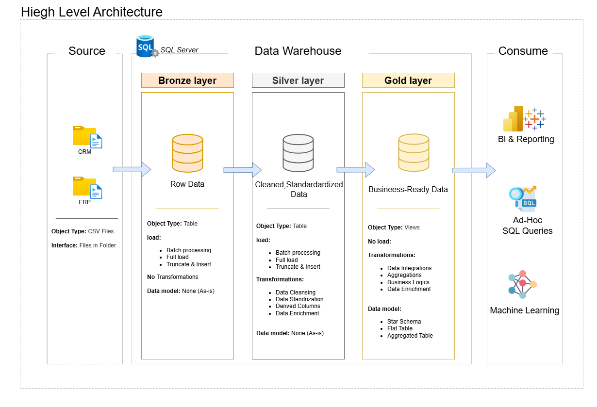

# Data Warehouse and Analytics Project (SQL Edition) 🚀

Welcome to the **Data Warehouse and Analytics Project** repository! 🏗️
This project showcases a complete end-to-end Data Engineering solution built entirely using **SQL Server** and **T-SQL**, focusing on building a robust Medallion Architecture.

---

## 📖 Project Overview
This project involves building a modern data warehouse using the **Medallion Architecture** (Bronze, Silver, and Gold layers).

1. **Data Architecture**: Designing a 3-tier warehouse for structured data using SQL Schemas.
2. **ETL Pipelines**: Automating data movement and logic using **Stored Procedures**.
3. **Data Modeling**: Developing Fact and Dimension tables (Star Schema) with primary/foreign key relationships.
4. **Analytics & Reporting**: Creating SQL-based data quality checks and views for business insights.

---

## 🏗️ Data Architecture
The data flows through three main stages as shown in the diagram below:

 

1. **Bronze Layer**: Raw data ingestion into SQL tables using `TRUNCATE` and `INSERT` logic.
2. **Silver Layer**: Data cleansing, standardization, and business logic implementation via SQL Scripts.
3. **Gold Layer**: Business-ready data modeled into a **Star Schema** for high-performance reporting.

---

## 🛠️ Tools & Technologies
- **Database**: SQL Server Express
- **Language**: T-SQL (Stored Procedures, Views, Functions)
- **Management Tool**: SQL Server Management Studio (SSMS)
- **Documentation**: Draw.io (for diagrams)
- **Version Control**: Git & GitHub

---

## 📂 Repository Structure
```text
sql-data-warehouse/
│
├── datasets/                           # Raw CSV files (Source data for bulk insert)
│
├── docs/                               # Project documentation and architecture details
│   ├── data_architecture.png           # Architecture diagram (Medallion Layers)
│   ├── data_catalog.md                 # Metadata and field descriptions
│   └── ERD_diagram.png                 # Entity Relationship Diagram (Star Schema)
│
├── scripts/                            # SQL ETL Pipeline
│   ├── bronze/                         # Stored Procedures for loading raw data
│   │   └── proc_load_bronze.sql
│   ├── silver/                         # Procedures for cleaning and transformation
│   │   └── proc_load_silver.sql
│   └── gold/                           # Procedures for creating Fact & Dimension tables
│       └── proc_load_gold.sql
│
├── tests/                              # Data Quality & Validation scripts
│   └── quality_checks.sql              # SQL queries to validate data integrity
│
├── README.md                           # Project overview and instructions
└── LICENSE                             # MIT License information
```

---

## 🛡️ License
This project is licensed under the [MIT License](LICENSE). You are free to use, modify, and share this project with proper attribution.

---

## About Me
Hi there! I'm **[Abdulrahman Ayman Farag]**, a Data Engineer/Analyst passionate about turning raw data into meaningful stories. 
Feel free to connect with me on [[LinkedIn](https://www.linkedin.com/in/abdelrhman-ayman-45b854361?utm_source=share_via&utm_content=profile&utm_medium=member_android)] or check my other projects!
